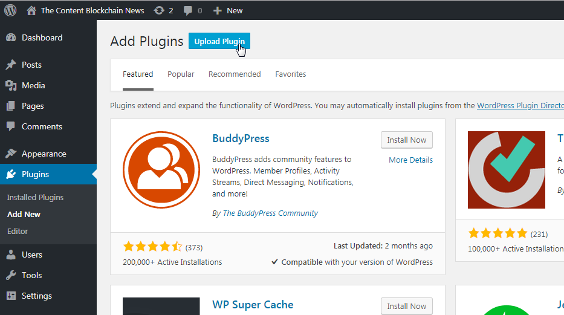
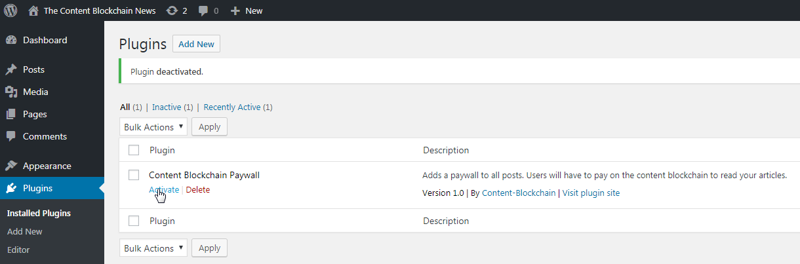
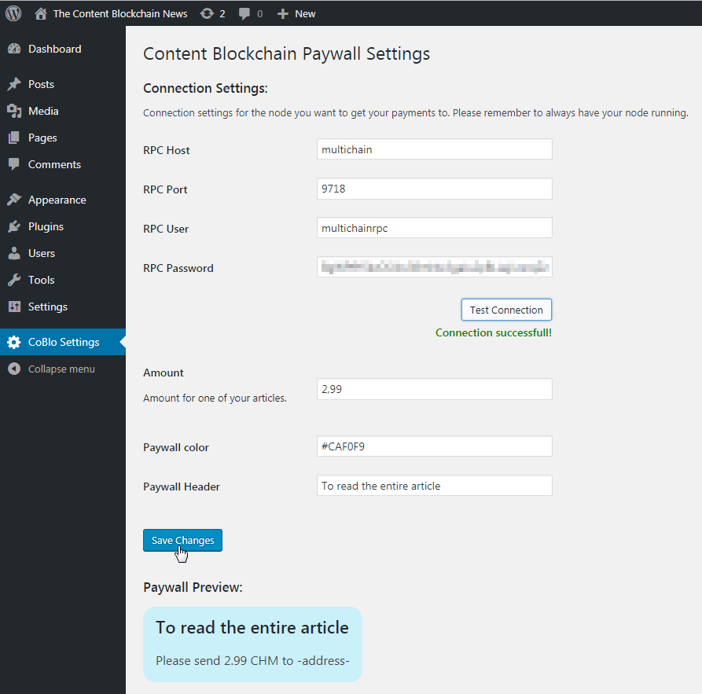
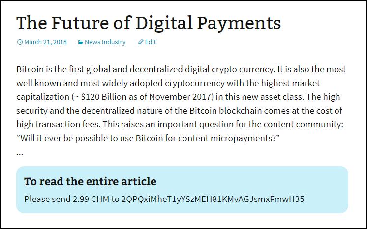

# Wordpress Content Blockchain Paywall Plugin

A Wordpress plugin to add a paywall to all articles on a Wordpress page.

With this plugin you can easily add a costumizable Plugin, that hides your content until the user has paid the 
configured amount to your Wallet.

## Setup

Download this project as ZIP

Upload the ZIP to your Wordpress Project

And activate it

Adjust the settings for this plugin in the menu "CoBlo Settings". Here you have to:
* Give the connection settings to your  MultiChain node (If you don't have a running node you can download and install 
it [here](https://www.multichain.com/download-install/).
(You can read he RPC User and the RPC Password from the multichain.conf in your local node folder)

* Give the amount the user has to pay for each of your articles

You can also adjust the header text and the color of the paywall.

If you want a small abstract on some of your articles, you can use the Wordpress more tag.

Now the plugin is active and the users can pay on a MultiChain Blockchain for your Articles:

